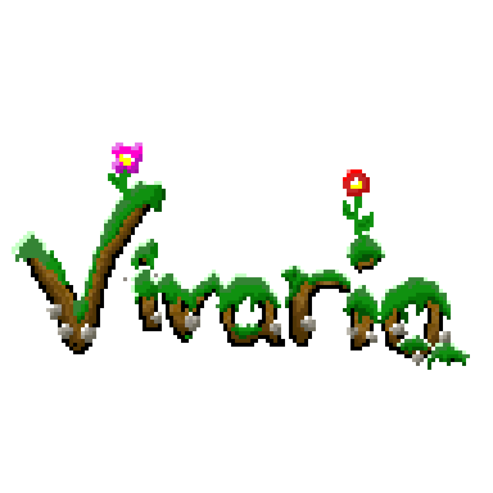

Simulateur écologique interactif en Python permettant d'observer l'évolution d'un écosystème (plantes, herbivores, carnivores) en temps réel et d'expérimenter l'impact de différents paramètres sur l'équilibre naturel.

---
## À propos

**Vivaria** est un projet développé dans le cadre des **Trophées NSI 2026** par trois élèves de Terminale NSI du Lycée Polyvalent Clos Maire, sous la direction des professeurs Chaddai Fouché & Christophe GUENEAU.

### Problématique
Comment **modéliser et visualiser** de manière interactive les **dynamiques d'équilibre et de déséquilibre** au sein d'un écosystème ?

### Objectif
Permettre à l'utilisateur d'**observer en temps réel** l'évolution des populations (plantes, herbivores, carnivores) et de **comprendre comment les modifications de paramètres environnementaux** (météo, saisons, biomes) impactent l'équilibre naturel.

---
## Fonctionnalités
### Simulation écologique
- **3 types d'entités** : Plantes, Herbivores, Carnivores
- **Comportements intelligents** : Les herbivores fuient les carnivores, les carnivores chassent les herbivores
- **Système d'énergie** : Manger = gain, vivre = perte, 0 énergie = mort
- **Vieillissement** et mort naturelle

### Environnement dynamique
- **4 biomes** : Forêt, Plaine, Désert, Toundra
- **4 météos** : Soleil, Pluie, Orage, Neige
- **4 saisons** : Printemps, Été, Automne, Hiver
- Chaque paramètre impacte la croissance, reproduction et survie

### Interface
- Affichage temps réel des populations
- Contrôle de la vitesse de simulation (x1, x2, x5, x10)
- Graphiques d'évolution
- Boutons interactifs pour modifier l'environnement

---
## Comment jouer
### Prérequis
- Python
- Pygame
- Matplotlib

### Installation
#### Cloner le projet
git clone https://github.com/AngelHydro/Vivaria.git
cd vivaria

#### Installer les dépendances
pip install -r requirements.txt

### Lancement
python main.py

### Contrôles
- **Clique gauche** sur "Démarrer" pour lancer la simulation
- **Clique gauche** sur les différents boutons pour impacter la simulation
- **F** : Basculer en plein écran

---
## Technologies utilisées

- **Python 3.8 ou supérieur** : Langage principal
- **Pygame 3.6.2** : Moteur graphique et gestion des sprites
- **Matplotlib** : Librairie pour les graphiques d'évolution
- **Programmation Orientée Objet** : Architecture modulaire

### Structure du projet
```
vivaria/
├── main.py           # Point d'entrée
├── ecosystem.py      # Logique des entités (Plantes, Herbivores, Carnivores)
├── display.py        # Gestion de l'affichage et des interactions
├── environment.py    # Système de biomes, météo et saisons
├── config.py         # Paramètres de configuration
├── graphique.py      # Gestion des graphiques d'évolution
└── data/             # Assets graphiques
```

---
## Équipe

**Angel SANCHEZ**  
Développement technique - Classes et fonctionnalités de simulation

**Augustin MINOT**  
Direction artistique - Textures, sprites et design visuel

**Benjamin MICHALAK**  
Interface utilisateur - Intégration visuelle et tests de simulation

---
## Projet scolaire

**Cadre :** Trophées NSI 2026  
**Établissement :** Lycée Polyvalent Clos Maire  
**Classe :** Terminale NSI  
**Encadrants :** Chaddai FOUCHE & Christophe GUENEAU (Professeurs de NSI)  
**Thème :** Nature
